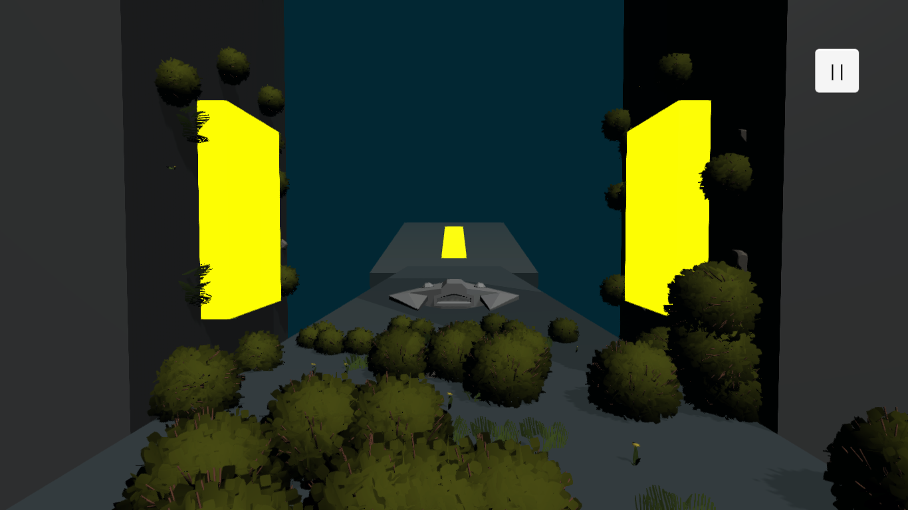
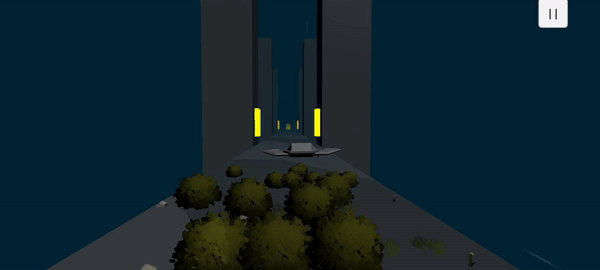

# To Infinity And Beyond

The development phase is not completely over.

## Project Details

Platforms determine our life trajectory. The events we experience unfold in a series. At some points, we are forced to make choices, while at others, we fall.

The things that flourish around us indicate our strong connection to our life path. They reflect that we are moving forward with more definite and resolute steps. However, when we detach from our life trajectory, these signs of growth diminish. For example, when a person loses their life purpose or experiences a very sad event, they fall down into emptiness without any control.

Ah, walls represent our learned helplessness. As time goes by, we realize that we have blown some things out of proportion in our minds. We believe that they can stop us or that their opinions matter.

## Project Images

